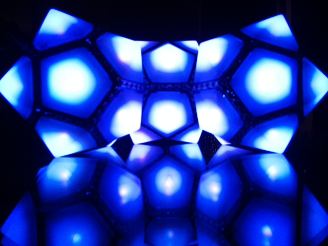

<!-- <!DOCTYPE html> -->
<html>
  <head>
    <meta charset="utf-8">
    <!--<title>Luxaeterna</title> -->
  </head>
  <body>
    <!--<h1>Welcome to the Infinite Playa!</h1>-->
    
    <h2>Luxaeterna</h2>
    
    <!--

    <iframe width="640" height="480" 
    src="https://www.youtube.com/embed/live_stream?channel=UCH1IeN5ZQYLfa2T7RVm72mA" 
    frameborder="0" allowfullscreen> </iframe> 
    
-->
    
Luxaterna is a light sculpture constructed from WS2822S LEDs embedded
      in pentagonal PCBs (i.e., BlinkyTiles) and controlled with an Adafruit Metro Mini. 
      Arduino/C++ and FastLED allow cycling through a series 
      of patterns and colors.
    

     
    
    
During the week of 30 August - 6 September, 2020, this page will
      (intermittently) display or provide access to a live stream video of Luxaeterna. 
      However, at various times other objects may be displayed; these might include 
      bones, shells, a stone lizard, a glass turtle or anything else that seems 
      interesting. Hopefully, Luxaeterna, along with similar 
      constructions will be displayed on playa in 2021. Time will tell.
    

    
Inspiration for Luxaeterna was provided by Bunnie Huang's masterpiece,
      <a href="https://wiki.techinc.nl/Polyhedrone">Polyhedrone</a>, which I
      had the pleasure of seeing in 2017, and
      <a href="https://www.solcrusher.com/">Solcrusher</a>, two much more
      ambitious projects.
    

    <!--<footer>-->
      

       Page created with <a href="https://atom.io/">Atom</a> 
       <a href="https://symbolicdomain.wordpress.com">Wordpress blog</a> 
       <a href="https://github.com/foustja">GitHub repositories</a>
      

    <!--</footer>-->
  </body>
</html>

